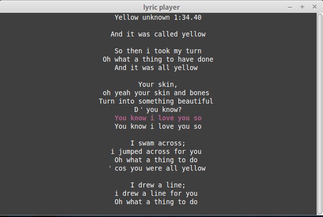

# Lyric Player

Play lyric in terminal.



## Install
```
$ npm install lyric-player -g
```

## Usage
```
$ lyric-player path/to/foo.lrc
```

| Keyboard key | Description |
|===========================|
|<kbd>Space</kbd>| Pause / Play |
|<kbd>Left</kbd> | backward for 3 seconds |
|<kbd>Right</kbd>| forward for 3 seconds|

Wihle the player is paused, <kbd>Left</kbd> and <kbd>Right</kbd> are disabled.


## License
MIT